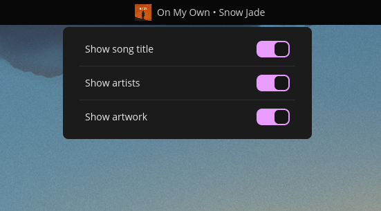

# Cosmic Applet Spotify

Tiny COSMIC panel applet that shows the currently playing Spotify track.

## Install

Download the `.flatpak` asset from the latest GitHub release and install it:

```bash
flatpak install --user --bundle io.github.snowjademusic.CosmicAppletSpotify.flatpak
```


## Screenshots





## License

GNU GPL v3.0 or later. See `LICENSE`.


## Releases

This repository uses Conventional Commits together with release-plz.

Use commit messages like `feat: add shuffle indicator`, `feat(ui): add shuffle indicator`, or `fix: handle missing player`.
On every push to `master`, release-plz opens or updates a release pull request that:

- bumps the crate version in `Cargo.toml`
- updates `CHANGELOG.md`

Merge that release PR to land the new version and changelog in `master`.

After that merge, release-plz automatically:

- creates the Git tag
- creates the GitHub Release

When the GitHub Release is published, CI builds `io.github.snowjademusic.CosmicAppletSpotify.flatpak` and attaches it to that release.

To ensure the publish event can trigger follow-up workflows, set a `RELEASE_PLZ_TOKEN` secret (PAT) and let release-plz use it instead of the default `GITHUB_TOKEN`.